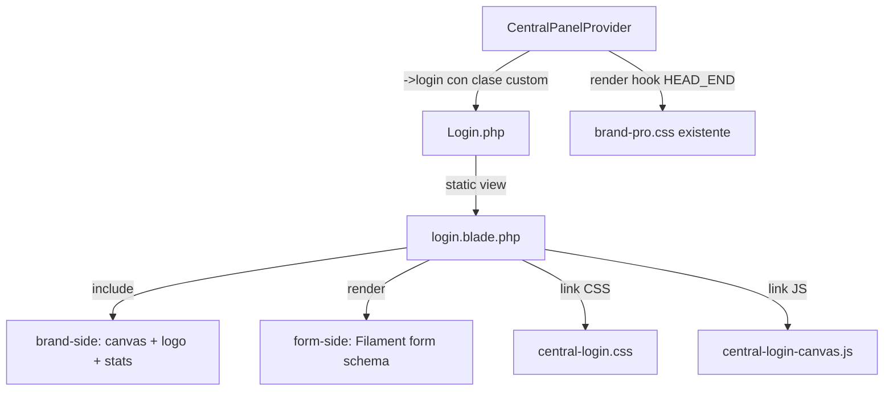
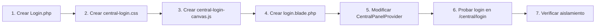

# Plan: Login Customizado — Panel Central DR RouteX

**Fecha:** 2026-04-16
**Panel afectado:** `central` (ID: `central`, path: `/central`)
**Filament version:** `v5.5` (`"filament/filament": "^5.5"`)
**Laravel version:** `v13.0`

---

## 1. Hallazgos del análisis

### 1.1 Versión de Filament

El proyecto usa **Filament v5.5** con Laravel 13. Esto es relevante porque:
- Las páginas de autenticación usan `Filament\Pages\Auth\Login` (no `Filament\Http\Livewire\Auth\Login` de v3)
- Los schemas de formulario usan el nuevo sistema `Filament\Schemas\Schema`
- Los render hooks usan `Filament\View\PanelsRenderHook`

### 1.2 Estado actual del panel central

[`CentralPanelProvider`](app/Providers/Filament/CentralPanelProvider.php:23) usa:
- Trait [`HasDrRouteBranding`](app/Providers/Filament/Concerns/HasDrRouteBranding.php:11) para branding global
- `->login()` sin argumentos = usa la página Login por defecto de Filament
- Auth guard: `central`
- No tiene tenancy middleware

### 1.3 Branding existente

[`HasDrRouteBranding`](app/Providers/Filament/Concerns/HasDrRouteBranding.php:13) ya inyecta:
- `brandName('Doctor Security')`
- `brandLogo(asset('images/logo-dr.svg'))`
- CSS via render hook `HEAD_END` → `css/filament/brand-pro.css`

### 1.4 Assets disponibles en `public/images/`

| Archivo | Uso actual |
|---------|-----------|
| `logo-dr.svg` | Logo claro del panel |
| `logo-dr-dark.svg` | Logo dark mode |
| `dr.svg` | Logo alternativo |
| `dr-light.svg` | Logo alternativo claro |
| `drroute-logo.png` | Logo PNG |

### 1.5 Diseño objetivo (plantilla.html)

Layout split con:
- **Lado izquierdo (55%)**: fondo oscuro `#0D1B2A`, canvas animado con nodos/vehículos GPS, logo SVG con anillos giratorios, nombre marca, stats en vivo
- **Lado derecho (45%)**: fondo blanco, formulario login estilo Filament
- **JS**: Canvas con 50 nodos + 8 vehículos animados, contadores live
- **CSS**: Variables CSS custom, animaciones keyframe, responsive

---

## 2. Arquitectura de la solución

### 2.1 Enfoque: Custom Login Page + Blade View



### 2.2 Por qué este enfoque

1. **Extender `Filament\Pages\Auth\Login`** mantiene toda la lógica de autenticación, validación y manejo de errores de Filament intacta
2. **Sobrescribir solo la vista Blade** da control total del layout sin tocar lógica PHP
3. **Renderizar el form de Filament dentro del layout custom** mantiene compatibilidad con Livewire, Alpine.js y el sistema de formularios de Filament v5
4. **CSS/JS separados** facilita mantenimiento y solo se cargan en la página de login del panel central

---

## 3. Archivos a crear

### 3.1 `app/Filament/Central/Pages/Auth/Login.php`

Clase PHP que extiende la página de login de Filament:

```
App\Filament\Central\Pages\Auth\Login
```

- Extiende: `Filament\Pages\Auth\Login`
- Propiedad: `protected static string $view = 'filament.central.pages.auth.login'`
- Panel: `central` (se infiere por el namespace discovery en `CentralPanelProvider`)
- NO necesita sobrescribir métodos de formulario — Filament se encarga del schema email/password/remember

### 3.2 `resources/views/filament/central/pages/auth/login.blade.php`

Vista Blade con layout split. Estructura:

```html
{{-- Layout wrapper --}}
<div class="drrx-login-root">
  
  {{-- LADO IZQUIERDO: Brand --}}
  <aside class="drrx-brand-side">
    <canvas id="drrxMapCanvas"></canvas>
    <div class="drrx-brand-content">
      {{-- Logo container con anillos GPS --}}
      {{-- Nombre marca DR RouteX --}}
      {{-- Stats en vivo --}}
    </div>
    <div class="drrx-route-line"></div>
  </aside>

  {{-- LADO DERECHO: Formulario Filament --}}
  <main class="drrx-form-side">
    <div class="drrx-form-wrapper">
      <header class="drrx-form-header">...</header>
      
      {{-- Renderizar formulario Filament --}}
      {{ $this->form }}
      
      {{-- Botón submit de Filament --}}
      {{ $this->authenticateAction }}
    </div>
  </main>

</div>
```

**Notas importantes sobre el renderizado del form:**
- En Filament v5, el formulario se renderiza via `{{ $this->form }}` dentro de un componente Livewire
- Los actions (botón login) se renderizan con `{{ $this->authenticateAction }}` o similar
- Se debe verificar la API exacta de Filament v5 para auth page rendering en la implementación
- Los errores de validación de Filament se muestran automáticamente

### 3.3 `public/css/filament/central-login.css`

CSS específico del login con:

| Sección | Contenido |
|---------|-----------|
| Variables CSS | `--blue-gps`, `--sidebar-bg`, `--green-route`, etc. |
| Layout split | Flexbox con `.drrx-login-root`, `.drrx-brand-side`, `.drrx-form-side` |
| Brand side | Canvas overlay, gradientes, logo container |
| Anillos GPS | `.drrx-gps-ring-1/2/3` con `@keyframes spinRing` |
| Pulso | `.drrx-gps-pulse` con `@keyframes pulseGps` |
| Stats | `.drrx-live-stats`, `.drrx-stat-item`, dot blink |
| Ruta animada | `.drrx-route-line` con `@keyframes routeSlide` |
| Form side | Wrapper, header, estilos complementarios |
| Responsive | Breakpoints 900px y 500px |
| Accesibilidad | `prefers-reduced-motion`, `:focus-visible` |
| Filament overrides | Ocultar header/sidebar/footer de Filament en la página login |

**Prefijo `drrx-`**: Todos los selectores usan prefijo para evitar colisiones con clases de Filament.

### 3.4 `public/js/filament/central-login-canvas.js`

JS del canvas animado, extraído de `plantilla.html`:

| Funcionalidad | Líneas aprox. en plantilla |
|--------------|---------------------------|
| Resize canvas | 934-939 |
| Generación de 50 nodos | 942-955 |
| Generación de 8 vehículos | 958-974 |
| Loop drawMap con conexiones/nodos/vehículos | 976-1062 |
| Contadores live con setInterval | 1218-1237 |

El script se auto-inicializa buscando `#drrxMapCanvas` y solo se carga en la página de login.

---

## 4. Archivos a modificar

### 4.1 `app/Providers/Filament/CentralPanelProvider.php`

Cambio mínimo — reemplazar `->login()` por `->login()` con la clase custom:

```php
// ANTES:
->login()

// DESPUÉS:
->login(\App\Filament\Central\Pages\Auth\Login::class)
```

Esto es **el único cambio** en un archivo existente. Todo lo demás son archivos nuevos.

---

## 5. Inyección de CSS/JS

### 5.1 Estrategia: Render Hook + @push/@stack en Blade

**CSS** se inyecta via render hook en `CentralPanelProvider` (o en el trait `HasDrRouteBranding`):

```php
->renderHook(
    PanelsRenderHook::HEAD_END,
    fn() => new HtmlString(
        '<link rel="stylesheet" href="' . asset('css/filament/central-login.css') . '" 
         data-navigate-track />'
    )
)
```

**Problema**: Esto cargaría el CSS en TODAS las páginas del panel central, no solo en login.

**Alternativa mejorada**: Incluir el CSS directamente en la vista Blade del login:

```blade
@push('filament-styles')
  <link rel="stylesheet" href="{{ asset('css/filament/central-login.css') }}" />
@endpush
```

O usar `@once` en la vista para inline CSS:

```blade
@once
  <style>
    /* CSS del login */
  </style>
@endonce
```

**Recomendación final**: CSS inline en la vista Blade con `@once` para evitar requests adicionales y asegurar que solo se carga en la página de login.

**JS** se incluye al final de la vista Blade:

```blade
@once
  <script src="{{ asset('js/filament/central-login-canvas.js') }}" defer></script>
@endonce
```

### 5.2 Fonts

Google Fonts se cargan en el `<head>` via render hook o en la vista Blade:

```blade
@once
  <link href="https://fonts.googleapis.com/css2?family=Outfit:wght@300;400;600;700;900&family=IBM+Plex+Sans:wght@300;400;500;600&display=swap" rel="stylesheet">
@endonce
```

Alternativa: Descargar fonts y servirlas localmente desde `public/fonts/` para evitar dependencia externa.

---

## 6. Aislamiento — Solo panel central

El cambio SOLO afecta el panel central por las siguientes razones:

| Mecanismo | Garantía |
|-----------|---------|
| Clase en namespace `App\Filament\Central\*` | Solo descubierta por `CentralPanelProvider` |
| Vista en `resources/views/filament/central/` | Namespace único, no compartido |
| CSS con prefijo `drrx-` | Sin colisión con estilos de otros paneles |
| JS con ID `#drrxMapCanvas` | Solo existe en la vista del login central |
| `CentralPanelProvider` es el único modificado | `AdminPanelProvider` y `TenantPanelProvider` intactos |

---

## 7. Orden de implementación



### Paso 1: Crear clase Login custom
- Archivo: `app/Filament/Central/Pages/Auth/Login.php`
- Extender `Filament\Pages\Auth\Login`
- Definir propiedad `$view`

### Paso 2: Crear CSS del login
- Archivo: `public/css/filament/central-login.css`
- Migrar estilos de `plantilla.html` con prefijo `drrx-`
- Incluir overrides para ocultar chrome de Filament en la página login
- Incluir responsive y accesibilidad

### Paso 3: Crear JS del canvas
- Archivo: `public/js/filament/central-login-canvas.js`
- Extraer lógica del canvas de `plantilla.html`
- Adaptar selectores a los IDs/clases con prefijo `drrx-`
- Auto-inicialización con verificación de existencia del canvas

### Paso 4: Crear vista Blade
- Archivo: `resources/views/filament/central/pages/auth/login.blade.php`
- Implementar layout split HTML
- Incluir CSS inline y JS
- Renderizar formulario Filament dentro del lado derecho
- Incluir logo SVG inline

### Paso 5: Modificar CentralPanelProvider
- Cambiar `->login()` por `->login(\App\Filament\Central\Pages\Auth\Login::class)`
- Verificar que no rompe el trait `HasDrRouteBranding`

### Paso 6: Probar
- Acceder a `http://appseguimiento.test/central/login`
- Verificar layout split, animaciones, formulario funcional
- Probar login con credenciales válidas e inválidas

### Paso 7: Verificar aislamiento
- Acceder a `http://appseguimiento.test/admin/login` — no debe tener cambios
- Acceder a login de tenant — no debe tener cambios
- Verificar que CSS/JS no se filtran a otros paneles

---

## 8. Consideraciones técnicas

### 8.1 Filament v5 Auth Page API

En Filament v5, `Filament\Pages\Auth\Login` es un componente Livewire. La vista Blade debe:
- Extender o usar el layout de Filament para panels
- Renderizar el formulario via la variable `$this->form` o el schema apropiado
- Mantener el action de authenticate funcional

**Riesgo**: La API exacta de renderizado del form en la vista Blade puede variar. Se debe verificar en la implementación con:
```bash
php artisan about
# o revisar vendor/filament/filament/resources/views/pages/auth/login.blade.php
```

### 8.2 Ocultar chrome de Filament

La página de login por defecto de Filament ya oculta sidebar y topbar. Pero con una vista custom hay que asegurarse de que:
- No se renderice el sidebar
- No se renderice el topbar
- El body tenga las clases CSS apropiadas

Filament maneja esto automáticamente si la vista se renderiza dentro del contexto del panel.

### 8.3 Logo SVG

El logo SVG de la plantilla es inline (no un archivo). Se recomienda:
- Mantenerlo inline en la vista Blade para las animaciones SVG (`<animate>`)
- Alternativa: Crear `public/images/drrx-logo-gps.svg` y referenciarlo

### 8.4 Performance del canvas

El canvas con 50 nodos y 8 vehículos usa `requestAnimationFrame`. Es ligero pero se debe:
- Verificar que se destruye al navegar fuera del login
- Considerar `prefers-reduced-motion` para desactivar animaciones

### 8.5 Social buttons

La plantilla incluye botones de Google y Microsoft. Estos son decorativos en la plantilla HTML. En la implementación:
- Se pueden omitir si no hay OAuth configurado
- O incluir como placeholders visuales sin funcionalidad

---

## 9. Estructura de archivos final

```
app/
  Filament/
    Central/
      Pages/
        Auth/
          Login.php                          ← NUEVO
  Providers/
    Filament/
      CentralPanelProvider.php              ← MODIFICADO (1 línea)
      Concerns/
        HasDrRouteBranding.php              ← SIN CAMBIOS

resources/
  views/
    filament/
      central/
        pages/
          auth/
            login.blade.php                 ← NUEVO

public/
  css/
    filament/
      central-login.css                     ← NUEVO
      brand-pro.css                         ← SIN CAMBIOS
  js/
    filament/
      central-login-canvas.js               ← NUEVO
  images/
    drrx-logo-gps.svg                       ← NUEVO (opcional, si no se usa inline)
```

**Total**: 4 archivos nuevos + 1 archivo modificado (1 línea)
